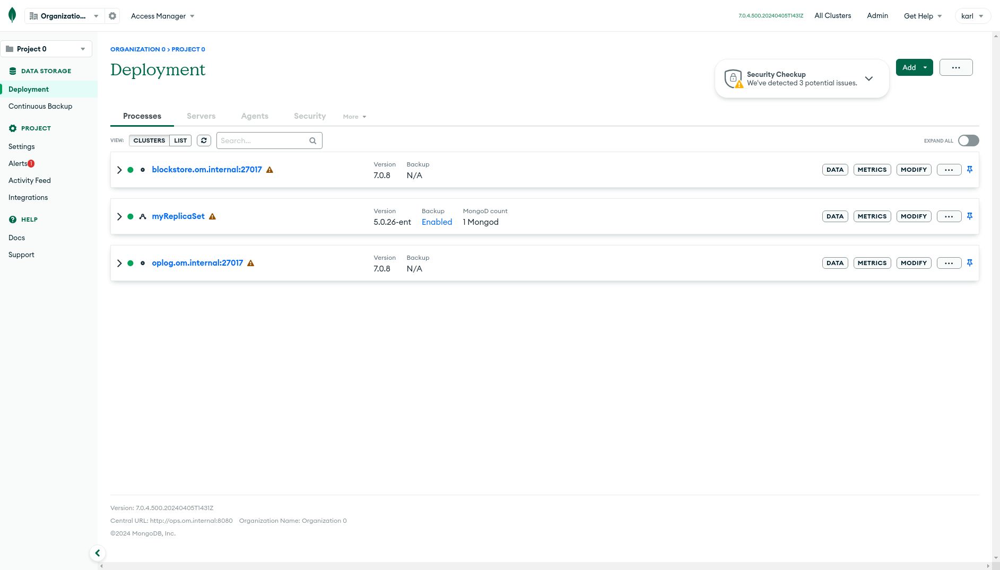

# mongo-infra-docker

**Get an Ops Manager (or Cloud Manager) environment up and running on your Mac (M1/Intel) or PC (Windows/Linux) with a single command. Batteries included.**

## Features

| Feature | Supported | Notes |
| --- | --- | --- |
| Ops Manager | :heavy_check_mark: | `cd ops-manager` |
| Cloud Manager |  :heavy_check_mark: | `cd cloud-manager` If you have low RAM, consider this instead of Ops Manager |
| MongoDB Agent | :heavy_check_mark: | - |
| BI Connector | :x: | Not included yet |
| Blockstore Backup | :heavy_check_mark: | - |
| S3 Backup | :heavy_check_mark: | [S3 Backup](/ops-manager/docs/BACKUP.md) |
| File Backup | :x: | - |
| Snapshot Restore | :heavy_check_mark: | - |
| PIT Restore | :heavy_check_mark: | - |
| Queryable Restore | :x: | Needs a certificate created on x86_64. Shouldn't work on M1/ARM (wrong binary) |

For more complex tests the following have been included already. Nothing is stopping you using your own also, these will  be added based on demand.

| Optional Extras | Supported | Notes |
| --- | --- | --- |
| TLS Certificates | :heavy_check_mark: | For Deployments see [Enable TLS](/ops-manager/docs/tls-for-ops-manager.md) |
| Load-balancer | :heavy_check_mark: | Balancer in front of single Ops Manager |
| Proxy | :heavy_check_mark: | Squid running on port proxy.om.internal:3128 |
| SMTP | :heavy_check_mark: | - |
| Prometeus | :x: | Not included yet |
| LDAP | :x: | Not included yet |
| Kerberos | :x: | Not included yet |
| KMIP | :x: | Not included yet |

## Usage

**Example 1:** 

Ops Manager and one MongoDB Agent (Make sure docker has access to **12G of RAM or more...** ...if you want to do backup testing)

1. On a Mac run `bash quick-start-mac-m1.sh` if you have an M1/M2/M3 or `bash quick-start-mac-intel.sh` if you have an Intel Mac
1. If you are running linux or windows, presumably on amd64/X86_64 run `bash quick-start-other-intel.sh`

2. The script will download, build and deploy Ops Manager, please click **Sign Up** and register your first user who will be the **Global Admin** then complete the Initial Setup screens (we have pre defined some values in conf-mms.properties, so you just need to click **Continue** until its done)

3. Once the project appears go to **Deployment >> Agents >> Downloads & Settings >> Select any operating system**
    1. On the wizard that appears click **+Generate Key**
    1. Take note of the values for
    ```
    mmsGroupId=123412341234123412341234
    
    mmsApiKey=123412341234123412341234123412341234123412341234123412341234123412341234
    
    mmsBaseUrl=http://ops.om.internal:8080
    ```
    1. Update the file `ops-manager/mongod-mms/automation-agent.config` with these values, it will be used by the node container in the next step

4. Press any key to unpause the script, it will download an Agent and start up a container with it running inside that is connected to the Ops Manager you deployed earlier, your environment is setup.

5. **Optional:** If you want an oplog store and block store for backup testing run `docker compose up -d oplog blockstore` they will be added to the same project, then you can use the OM ui to install standalones, then move to the Admin UI and configure them as backup targets. If you setup TLS in the project, I'd recommend setting TLS for metadata to AllowTLS so that you don't have to mess with the OM keystore (unless that is what you are testing)

6. **Optional:** If you want a proxy you can run `docker compose up -d proxy`, it will be available on http://proxy.om.internal:3128 and can work with http or https. View container logs if you want to see what is using the proxy. It is allocated around 125mb of Memory.

7. **Optional:** If you want a load-balancer run `docker compose up -d lb`, it will be availble on http://lb.om.internal and you should set your Ops Manager Central URL to this and set `X-forwarded-for`. It uses about 125mb of Memory.

8. **Optional:** If you want to see emails sent by Ops Manager run `docker compose up -d smtp` you can then go to http://localhost:1080 to see a webui and all the emails set to `smtp.om.internal:1025` it only captures while its running, so it won't show you emails from before it ran, but if you need to do email resets or check invites/alerts. It uses about 125mb of Memory.

### Result

If you followed steps 1 - 6 you should have something like this within 10 minutes:



## Hints and tips:

- Ops Manager needs 8G RAM to run reliably, an Agent 2.5G, so for Monitoring/Automation your looking at giving docker 10.5G
- TLS certificates (testing use only) are available, please see [Enable TLS](/ops-manager/docs/tls-for-ops-manager.md) for more details
- Stopping/Starting Ops Manager and Containers
  - `docker compose pause` # will pause all the containers from running state
  - `docker compose unpause` # will get them all going again 
- Getting a Shell / SSH on the containers
  - `docker exec -it ops /bin/bash` runs bash as root on the **ops** container
  - `docker exec -it node1 /bin/bash` runs bash as root on the **node1** container
  - you can just look at the docker-compose.yml to see what each container is called, or you can see it in `docker ps`
  - `docker stats` is a great way to see the cpu/memory usage and limits of each container 
 
**Example 2:** 

3x MongoDB Agents for Cloud Manager (with systemd)

1. Create a Cloud Manager project
    1. Create a Cloud Manager project on https://cloud.mongodb.com and go to **Deployment >> Agents >> Downloads & Settings >> Select your operating system**
    2. Pick any OS and on the wizard that appears, click generate an API key
    3. Take note of the values for
    ``` 
    mmsGroupId=123412341234123412341234

    mmsApiKey=123412341234123412341234123412341234123412341234123412341234123412341234
    ```
    4. Update the file `cloud-manager/mongod-mms/automation-agent.config` with these values
2. `cd cloud-manager` and run **only 1** of these download scripts to obtain the agent for your architechture 
```
bash assets/aarch64_CM-agent.sh # if your are on M1/ARM/Aarch64
bash assets/x86_64_CM-agent.sh  # if your are on Intel Mac/Windows/Linux
```
3. **Optional: update the `cloud-manager/docker-compose.yml` file, to select the right build file, the default is aarch64 for M1/ARM/Aarch64, you can change it to x86_64 for Intel Mac/Windows/Linux on line 6, 30, 54**

4. `docker compose up -d n1cm n2cm n3cm` this will build three containers with all the tools and dependencies you need. It will install and configure the MongoDB Agent (for Cloud Manager) that you downloaded in step 2, and connect it to the group you setup in step 1. The container has systemd and behaves like an operating system and is visible in your Cloud Manager project under **Deployment >> Agents >> Servers**.

5. **Optional:** if you need more nodes you can run `docker compose up -d n4cm n5cm n6cm`, they will appear in the same project. Each uses about 2.5GB of Memory.


## Disclaimer

This software is not supported by [MongoDB, Inc](https://www.mongodb.com) under any of their commercial support subscriptions or otherwise. Any usage of this tool is at your own risk. It's intended only to serve as a test and environment.

## Changelog
- 2024-05-07 Added a single script with menu to select platform/arch
- 2024-05-03 Added disclaimer and feature tables to README.md
- 2024-05-01 Initial run at a simplified s3 setup
- 2024-04-25 Set some defaults in conf-mms.properties so initial startup is faster, add smtp catcher, initial attempt at s3 support
- 2024-04-23 Added working nginx loadbalancer and squid proxy
- 2024-04-22 Single command needed to do everything, added oplog/blockstores/metadata with resonable sizes
- 2024-04-16 Confirmed working on ARM/M1/Aaarch64, updated docs, set aarch64 as default as most users of this project (80%) are using M1's to run test environments
- 2024-04-15 Make CM act more like the OM container, change container names so you can run OM/CM agents at the same time with no clash
- 2024-04-11 Initial x86_64 Ops Manager Proof of Concept aarch64 for Cloud Manager confirmed good on Windows/M-series mac
- 2024-04-10 Initial x86_64 Cloud Manager Proof of Concept, with an untested version for aarch64

Copyright 2024 Karl Denby
