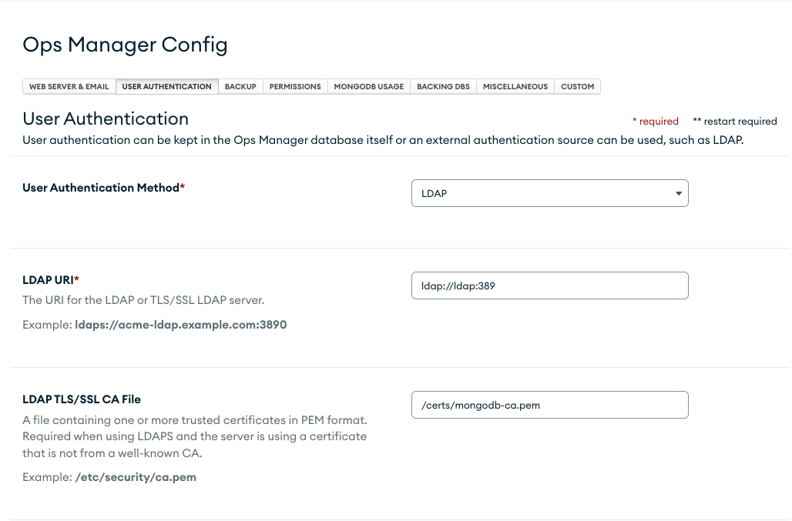
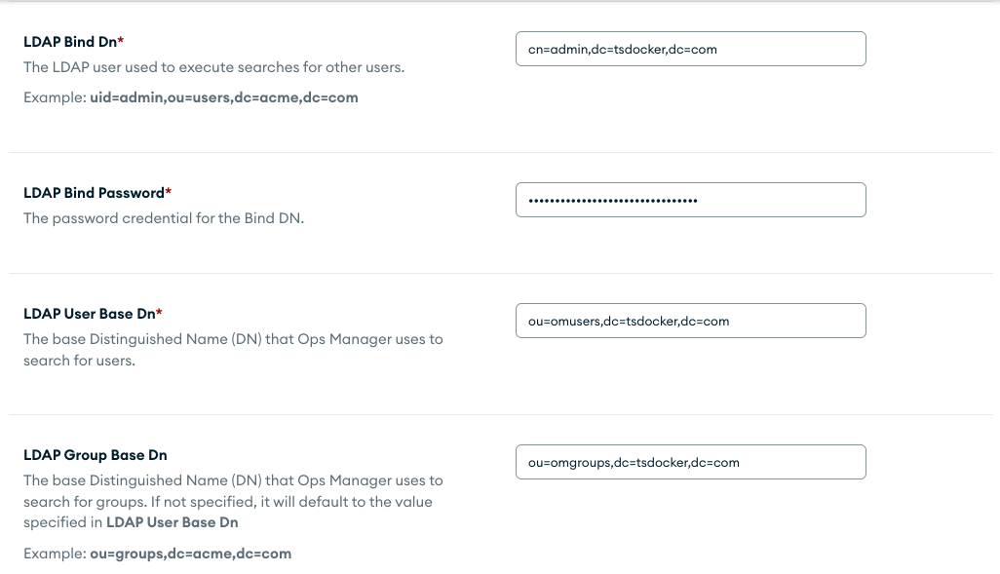
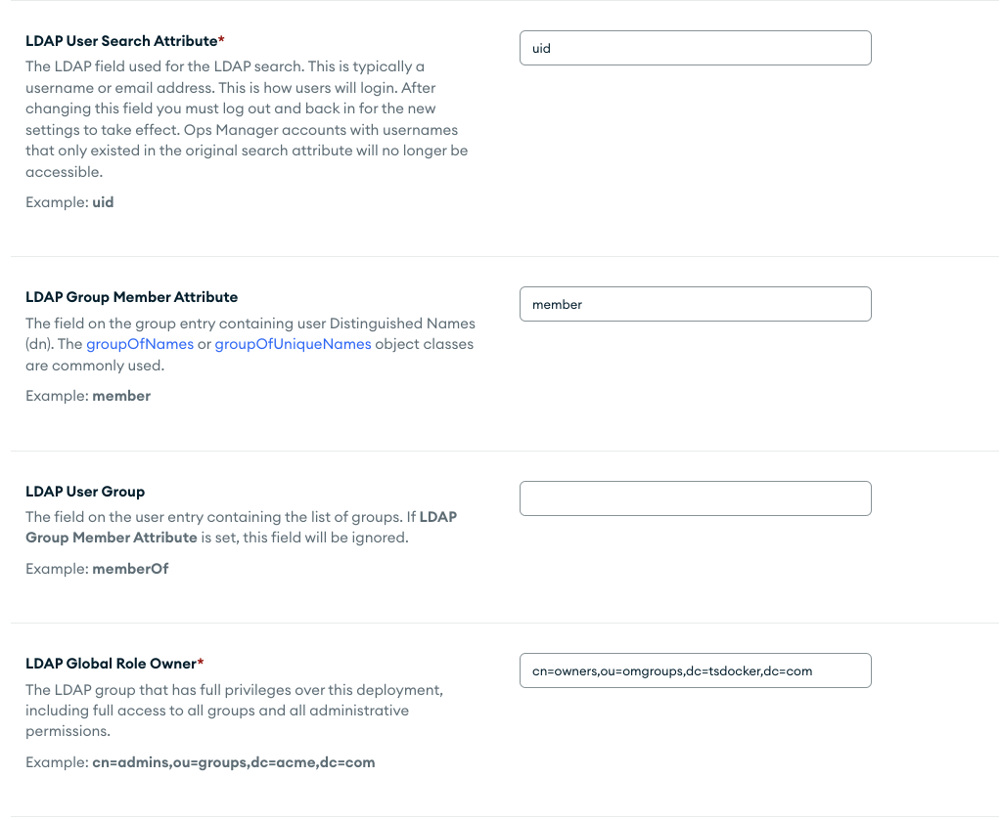
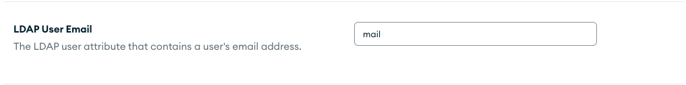
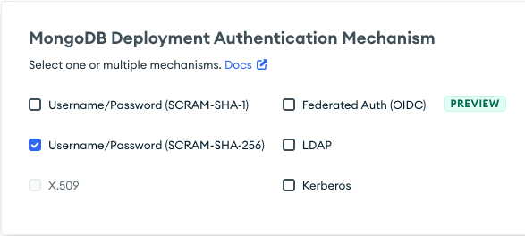
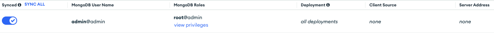
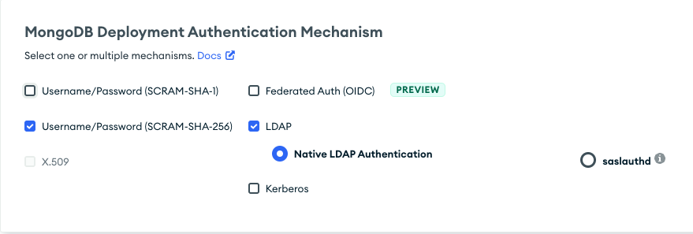
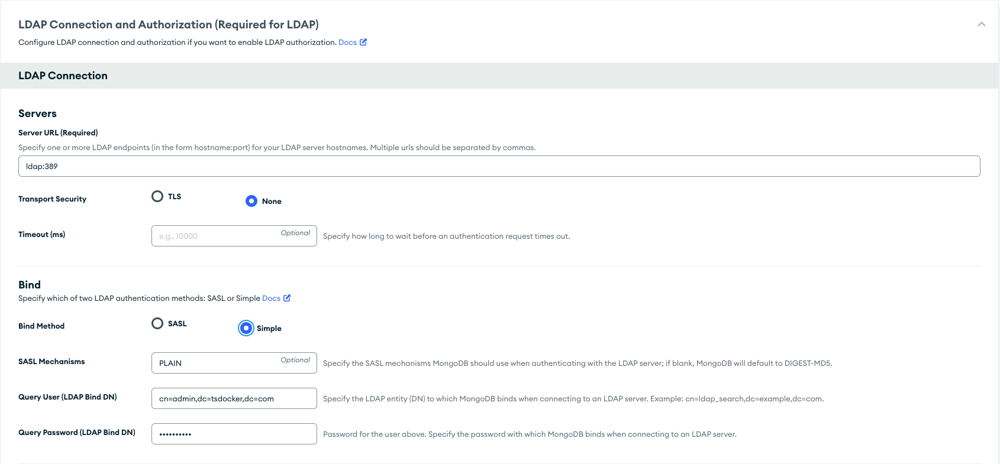
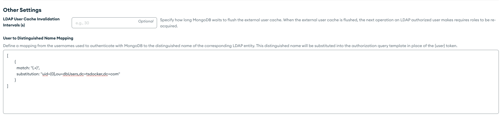

# LDAP

## User and groups structure

All users have the same password, `Password1!`. The following users have been predefined:

### MongoDB database users
|User|MemberOf|
|-|-|
|uid=dba,ou=dbUsers,dc=om,dc=internal|cn=dbAdmin,ou=dbRoles,dc=om,dc=internal|
|uid=writer,ou=dbUsers,dc=om,dc=internal|cn=readWriteAnyDatabase,ou=dbRoles,dc=om,dc=internal|
|uid=reader,ou=DbUsers,dc=om,dc=internal|cn=read,ou=dbRoles,dc=om,dc=internal|

### Ops Manager Agents
|User|MemberOf|
|-|-|
|uid=mms-automation,ou=dbUsers,dc=om,dc=internal|cn=automation,ou=dbRoles,dc=om,dc=internal|
|uid=mms-monitoring,ou=dbUsers,dc=om,dc=internal|cn=monitoring,ou=dbRoles,dc=om,dc=internal|
|uid=mms-backup,ou=dbUsers,dc=om,dc=internal|cn=backup,ou=dbRoles,dc=om,dc=internal|

### Ops Manager users
|User|MemberOf|
|-|-|
|uid=owner,ou=omusers,dc=om,dc=internal|cn=owners,ou=omgroups,dc=om,dc=internal|
|uid=reader,ou=omusers,dc=om,dc=internal|cn=readers,ou=omgroups,dc=om,dc=internal|
|uid=admin,ou=omusers,dc=om,dc=internal|cn=owners,ou=omgroups,dc=om,dc=internal|

Use the extras.sh script and select "ldap" to start.

## How to Allow LDAP Auth in Ops Manager

* Access `Admin` At the top -> `Ops Manager Configiration` -> `User Authentication` and select

User Authentication Method: `LDAP`
LDAP URI: `ldap://ldap:389`
LDAP TLS/SSL CA File: `/certs/mongodb-ca.pem`

LDAP Bind Dn: `cn=admin,dc=om,dc=internal`
LDAP Bind Password: `Password1!`
LDAP User Base Dn: `ou=omusers,dc=om,dc=internal`
LDAP Group Base Dn: `ou=omgroups,dc=om,dc=internal`

LDAP User Search Attribute: `uid`
LDAP Group Member Attribute: `member`
LDAP Global Role Owner: `cn=owners,ou=omgroups,dc=om,dc=internal`

LDAP Users Eamil: `mail`

LDAP Global Role Read Only: `cn=readers,ou=omgroups,dc=om,dc=internal`
* Validate your access by logging out and back into Ops Manager with the user `admin` and the password `Password1!`, you can also validate with thre user `reader`.


## How to Allow LDAP Auth for Users in your deployments
* Important: LDAP Auth is supported ONLY in enterprise versions of mongodb - make sure the deployment has an enterprise version installed.

1. Access your Organization -> Projects -> Security -> Settings -> Select `Username/Password (SCRAM-SHA-256)` & Click `Save Settings`.

2. Access the `MongoDB Users` tab and create an `admin@admin` user with `root@admin` role and the same password (`Password1!`).

3. `Review and Deploy` & `Approve and Deploy` the changes.
4. Access the `Settings` tab and select `LDAP` Then select `Native LDAP Authentication`.

Server URL (Required): `ldap:389`
Transport Security: `None`
Bind Method: `Simple`
SASL Mechanisms: `PLAIN`
Query User (LDAP Bind DN): `cn=admin,dc=om,dc=internal`
Query Password (LDAP Bind DN): `Password1!`

```
[
  {
    match: "(.+)",
    substitution: "uid={0},ou=dbUsers,dc=om,dc=internal"
  }
]
```
5. Click on `Validate LDAP Configuration` and make sure it returns Green and OK - if not retrace your steps and follow this guide to the T.


6. Under `LDAP Authorization` Turn on the `Acquire users and roles from LDAP` switch and fill in the following:

Authorization Query Template: 
```
{USER}?memberOf?base
```
7. Click `Save Settings`, `Review and Deploy` & `Confirm And Deploy` to enable your changes
8. Validate your access with the following command
```
mongosh localhost:27171 --username writer --password Password1! --authenticationDatabase '$external' --authenticationMechanism PLAIN
```
* You can also validate with the users `dba` & `reader`