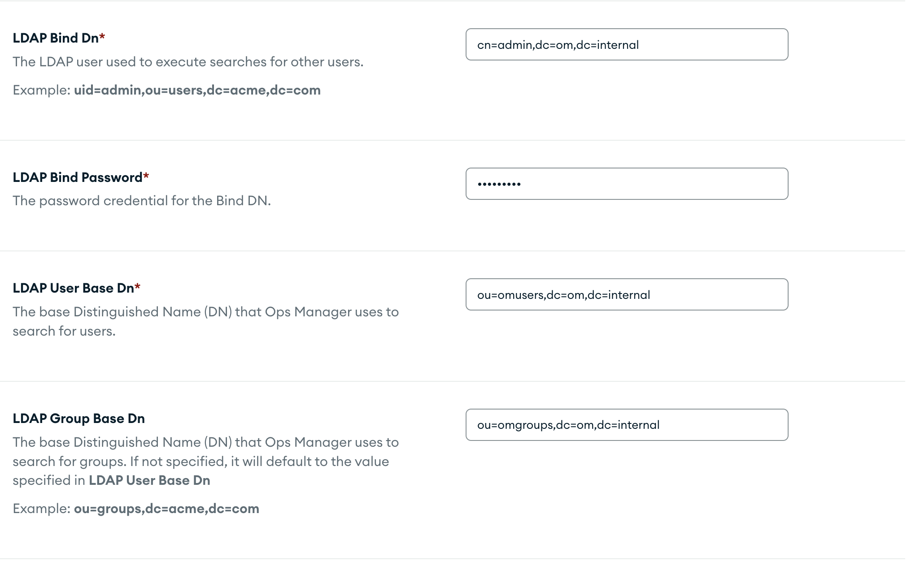
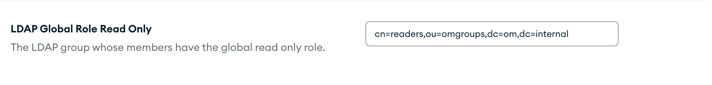

## User and groups structure

All users have the same password, `Password1!`. The following users have been predefined:

### MongoDB database users
|User|MemberOf|
|-|-|
|uid=dba,ou=dbUsers,dc=tsdocker,dc=com|cn=dbAdmin,ou=dbRoles,dc=tsdocker,dc=com|
|uid=writer,ou=dbUsers,dc=tsdocker,dc=com|cn=readWriteAnyDatabase,ou=dbRoles,dc=tsdocker,dc=com|
|uid=reader,ou=DbUsers,dc=tsdocker,dc=com|cn=read,ou=dbRoles,dc=tsdocker,dc=com|

### Ops Manager Agents
|User|MemberOf|
|-|-|
|uid=mms-automation,ou=dbUsers,dc=tsdocker,dc=com|cn=automation,ou=dbRoles,dc=tsdocker,dc=com|
|uid=mms-monitoring,ou=dbUsers,dc=tsdocker,dc=com|cn=monitoring,ou=dbRoles,dc=tsdocker,dc=com|
|uid=mms-backup,ou=dbUsers,dc=tsdocker,dc=com|cn=backup,ou=dbRoles,dc=tsdocker,dc=com|

### Ops Manager users
|User|MemberOf|
|-|-|
|uid=owner,ou=omusers,dc=tsdocker,dc=com|cn=owners,ou=omgroups,dc=tsdocker,dc=com|
|uid=reader,ou=omusers,dc=tsdocker,dc=com|cn=readers,ou=omgroups,dc=tsdocker,dc=com|
|uid=admin,ou=omusers,dc=tsdocker,dc=com|cn=owners,ou=omgroups,dc=tsdocker,dc=com|

Use the extras.sh script and select "ldap" to start.

## How to Allow LDAP Auth in Ops Manager

User Authentication Method: `LDAP`
LDAP URI: `ldap://ldap:389`
LDAP TLS/SSL CA File: `/certs/mongodb-ca.pem`

LDAP Bind Dn: `cn=admin,dc=tsdocker,dc=com`
LDAP Bind Password: `Password1!`
LDAP User Base Dn: `ou=omusers,dc=tsdocker,dc=com`
LDAP Group Base Dn: `ou=omgroups,dc=tsdocker,dc=com`

LDAP User Search Attribute: `uid`
LDAP Group Member Attribute: `member`
LDAP Global Role Owner: `cn=owners,ou=omgroups,dc=tsdocker,dc=com`

LDAP Users Eamil: `mail`

LDAP Global Role Read Only: `cn=readers,ou=omgroups,dc=tsdocker,dc=com`