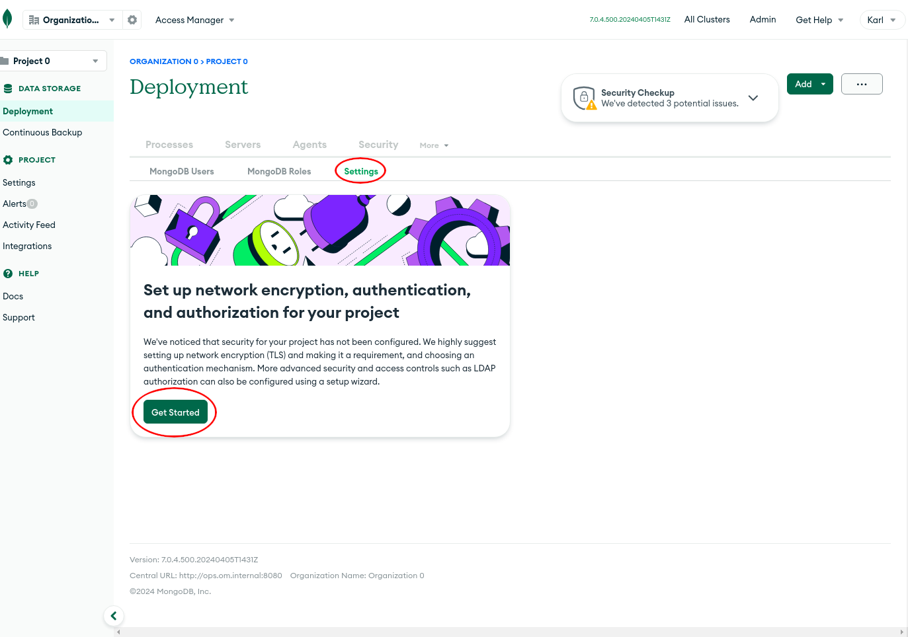
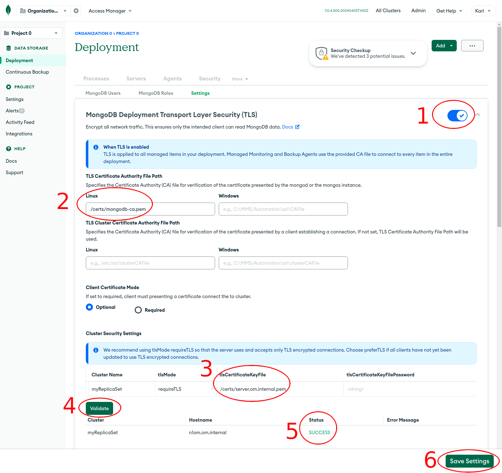
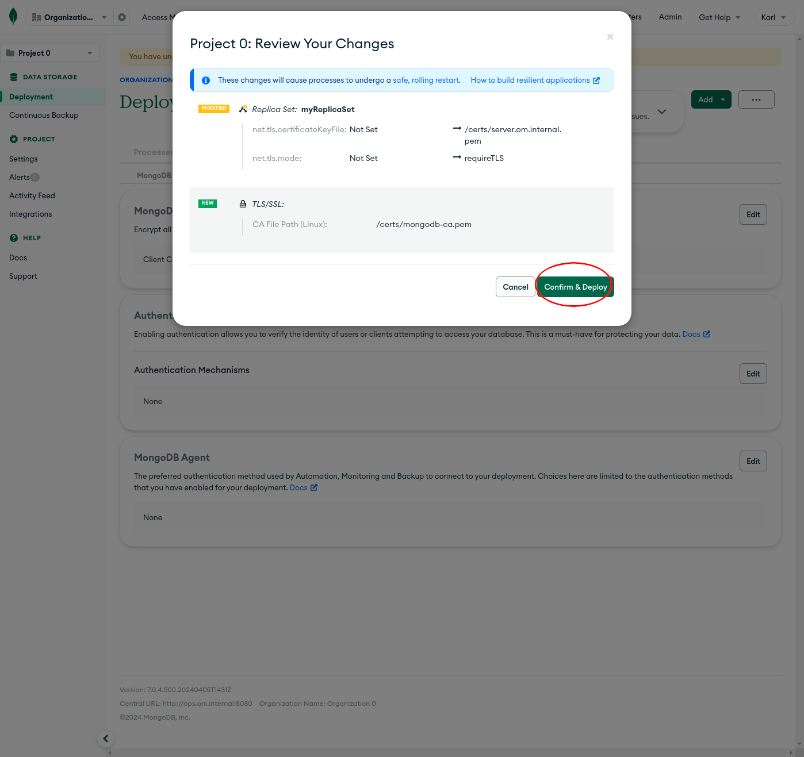
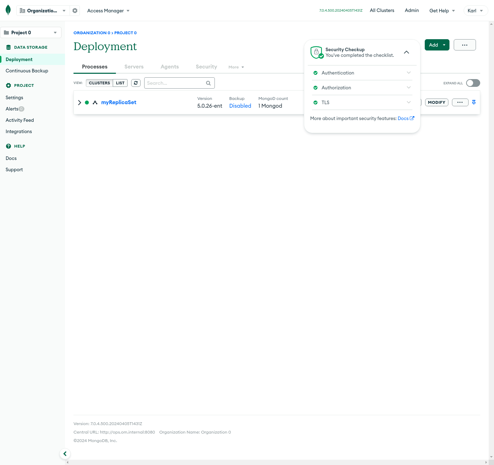

# Setup TLS for a Deployment Managed by Ops Manager

1. Select **Deployment** on the left hand panel

2. Select **Security >> Settings** and click **Get Started**


3. Set the following
```
TLS Certificate Authority File Path:
- Linux = /certs/mongodb.ca.pem

Cluster Security Settings:
- tlsCertificateKeyFile = /certs/server.om.internal.pem
```


Press validate and wait until it confirms everything is working

4. Confirm and apply the changes


5. You should also setup a user (authentication) with defined roles (authorization) so that the security check is healthy
